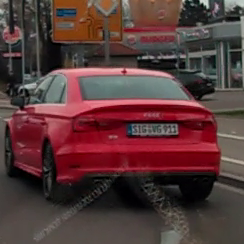
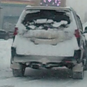
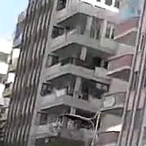
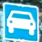
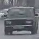
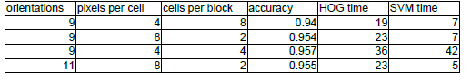
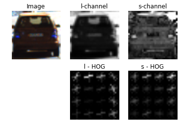
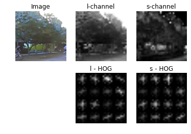
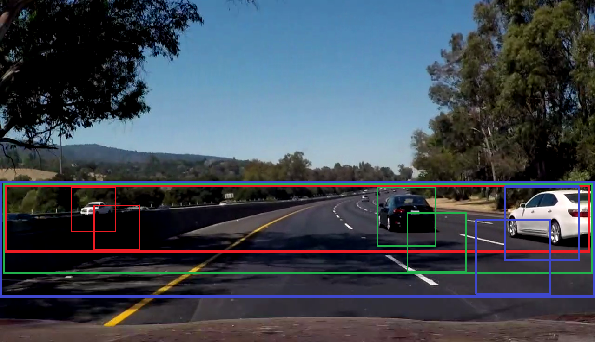
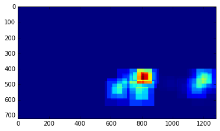

# **Vehicle Detection Project**

The goals / steps of this project are the following:

* Perform a Histogram of Oriented Gradients (HOG) feature extraction on a labeled training set of images and train a classifier Linear SVM classifier
* Implement a sliding-window technique and use your trained classifier to search for vehicles in images.
* Run pipeline on a video stream (start with the test_video.mp4 and later implement on full project_video.mp4) and create a heat map of recurring detections frame by frame to reject outliers and follow detected vehicles.
* Estimate a bounding box for vehicles detected.


### Histogram of Oriented Gradients (HOG)


### 1. Dataset

I started with the dataset, provided by Udacity, but soon uppended it with [my own dataset](https://drive.google.com/file/d/0BySmjNMv1bBCdVR6aXZxNUlPUjA/view?usp=sharing).

Here are examples of car images from this set:




It really contains a lot of cars covered with snow - not specially, just this year
we had snow from the beginning October to the end of April

Not-cars in this set were mostly collected as false positives of previously trained
detector, they contain a lot of interesting staff:




This dataset was collected for vehicle detection in a Forward Collision Warning task,
so it contained only images of the vehicles right ahead, and 'side views' were considered as
negative examples. For this project I reviewed the set (moving some images between classes),
now it contains about 14500 positive examples (vehicles) and 16200 negative examples (not vehicles)

I collected this dataset using my car detector, based on OpenCV [CascadeClassifer](http://docs.opencv.org/trunk/db/d28/tutorial_cascade_classifier.html) with LBP featues.
I did not use this classifier in the project because:
- it is clearly stated that we must use HOG features and sliding windows
- my classifer does not detect vehicles veewn from the side, and to retrain it is too large a task 
(it takes about 10 days now)


#### 2. HOG features extraction

The code for this step is contained in lines # through # of the file called `some_file.py`).  

Basing on my experiense, I decided to use images of size 32x32 pixels: I know that it is possible 
to detect the car with a window of such size - and it is computationally cheeper.

I looked at, but rejected the idea of color-based detection. I can't say for California, 
but here, in St.-Petersburg, it is often impossible to find any color in car images:




But I didn't discard color completely (converting images to gray) - I just separated intensity
and color information by converting images into the HLS color space.

To chose HOG parameters, I built a simple pipeline, consisting of feature generation and
SVM training on a small subset (1000 images) of the data. 

Final desison was made basing not on accuracy only - but also on time required to calculate
HOG features and train SVM.

Let me give you some examples (all of them - for window 32x32):



As you can see, configuration (9,4,4) gives slightly better resuls, but takes
much longler to compute and to train. With window size 64x64 the result was (obviously)
even better (accuracy 0.98) but it took 75 seconds to compute HOG features.

So, finally I selected configuration with 11 orientations, 8 pixels per cell and 2 cels per block
(last row in the table).

Here is an example of HOG features for car image:



and for not-car image:



#### 3. SVM training.

To estimate best SVM parameters, I used grid search (file , lines # - #). I performed the search
in consequtive steps, reducing search range on each step.

For each step new random subset of traingin data was chosen.

Final SVM parameters were: C = 2.3, gamma = 6.4e-4.

At this point I noticed, that SVM training and inferece takes a lot of time, and decided to 
try HOG and SVM modules from OpenCV.

And it worked!

HOG extraction time reduced from 68 s to 27 s, SVM training time - from 918 to 45 secodns,
and SMV prediction time (on 1000 samples) - from 11 s to 0.5 s!!!

So, from this point I used OpenCV HOG and SVM implementations instead of Sklearn ones.

### Sliding Window Search

#### 1. Vehicle seacrh.

To start search, we must:
- define scales (sizes of vehicles we would search for)
- define search ranges for each scale

Do define possible scales, I measured images of the vehicles on different distances.
It appeared that, given the search windows size of 32x32 pixels, we are interested in 
scales from 3 to 5 (corresponding window sizes in original image from 96x96 to 160x160 pixels).

I defined search ranges as starting from the point a little bit above the horizeon (yTop = 400)
and large enough to fit two rows with 50% overlap.

I tested different combinations of scales and step size: larger number of scales and smaller steps
lead to better localization - but slow down the detection significantly and increase the number
of false detections.

Finally, I restrincted scale list to [3, 4, 5] and step size to 1/2 (2 cells, or 16 pixels in 
downscaled window).

Search ranges and examples of search windows positions are shown on the figure below:



#### 2. Optimizaton

For the first varian of search I used function from the lesson with necessaray modifications
due to the fact that OpenCV SMV always returns vectors. Therefore, I resized the vector response to
the proper size:
```
    #hog vector length
    hogSize = nblocks_per_window * nblocks_per_window * cell_per_block * cell_per_block * orient

    #define shape for target matrices
    hogShape = (nysteps, nxsteps, hogSize)
 
    # Compute individual channel HOG features for the entire image
     hog1 = get_hog_features(ch1, orient, pix_per_cell, cell_per_block, window, cells_per_step).reshape(hogShape)
```
But calculations performed that war were too slow - only 3-5 frames per second.

Then I decided to try 'batch calculations' (as we use batch mode in ANNs), and rewrite detection fucntion so,
that it collects a bunch of features (all sliding windows from one scale), and then performs
`svm.predict` on the resulted array.

With this optimization I achieved a speed of 11 - 15 frames per second (on i5 descktop CPU).

#### 3. Additional filtering 

This detector (as every other one) is not ideal: it reports a numbwer of false positives, and
misses some vehicles (false negatives).

To improve situation, I used heatmap, averaged over time with exponentioal decay:
```
   heatmap = heatmap * tau + new_heatmap_
```

Example of the heatmap you can see below.



Actually, it's a resulting heatmap (what we get after the last frame of the `project_video`).

Time constant `tau` and threshold were defined experimntally, resulting values are 0.96 and 12.
You can see, that we nearly detected the car that appears in the left corner of the frame.
 


### Video Implementation


Here's a [link to my video result](./project_result.mp4). It's not ideal - but
it has not false negatives (no missed vehicles), and only 3 false positives.

Earlier I received what seems a [better result](./old_result.mp4) - but in reality there
was an error in heat-map calculation, so I consider it as an accident. And I confirmed it
by a simple experiment: shift in detection range resulted in a huge amoount of false positives.


---

### Discussion

I see this project as a starting point to the vehicle detection. 
Techniques used here (HOG and SVM) are certainly a 'must-know' for anybody who works with detection.
But they are neither too fast nor too precise.

Where to go farther? It depends on your task.

For example, for Forward Collision Warning we need high speed detections: main algorithms
(PATH etc.) use relative speed as a basic measure, and to obtain good relative speed we must
have dense (in time) measurements. So, for this system I choose Viola-Jones framework: cascade detection, calculated
with LBP features over the integral image. That approach works with 100-200 fps on PC - and
with 15-20 fps on mobile phone!

(*If you are interested, you can check an example of
implementation in my [test application](https://drive.google.com/open?id=0BySmjNMv1bBCRmVxQkxMOXZUd0E).
It is not a production software, that one is in private beta now*).

But what if you must detect not only vehicles? On the road, car can meet bycicles, pedestrians,
barriers, animals... Want to add up separate detector for each object? 

So, if the task becomes so serious, we must choose some CNN-based detection (YOLO, SSD) - 
and appropriate hardware.

But even then I'll have a question: will your system detect and recognize UFO? Dragon? ET?

